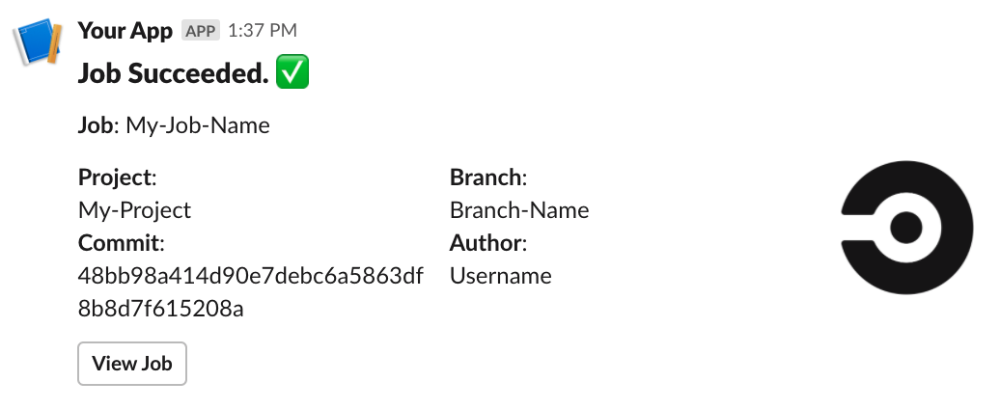
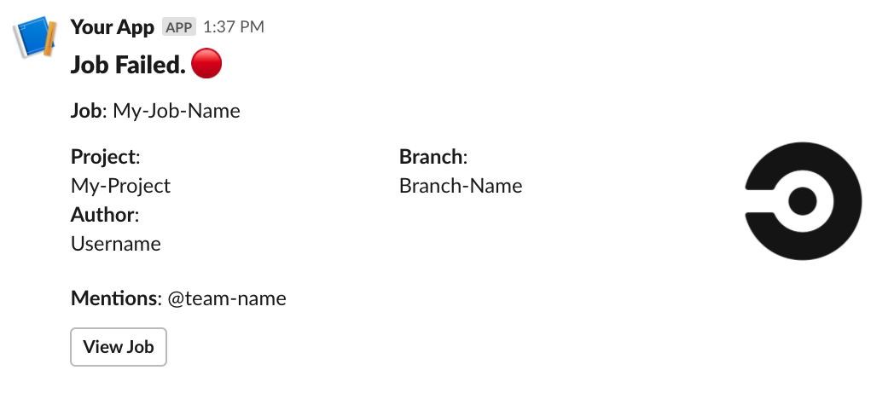
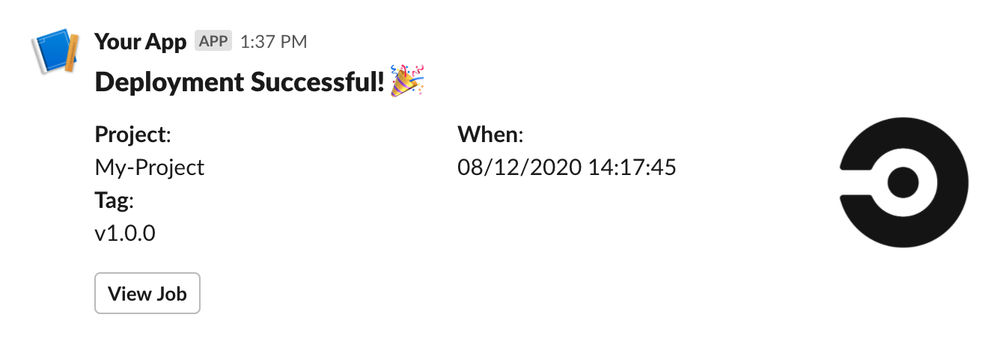
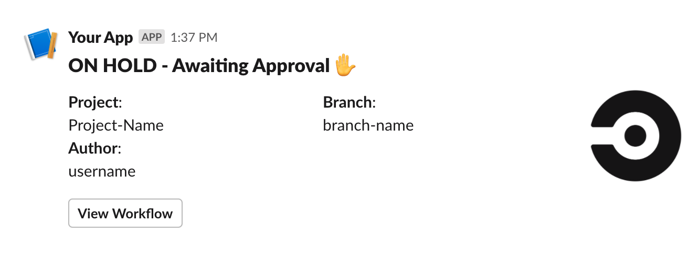

# Slack Orb  [](https://circleci.com/gh/CircleCI-Public/slack-orb) [](https://circleci.com/orbs/registry/orb/circleci/slack) [](https://raw.githubusercontent.com/circleci-public/slack-orb/master/LICENSE) [](https://discuss.circleci.com/c/ecosystem/orbs)

Send Slack notifications from your CircleCI pipelines even easier with Slack Orb 4.0

[What are Orbs?](https://circleci.com/orbs/)

## Usage

### Setup

In order to use the Slack Orb on CircleCI you will need to create a Slack App and provide an OAuth token. Find the guide in the wiki: [How to setup Slack orb](https://github.com/CircleCI-Public/slack-orb/wiki/Setup)

### Use In Config

For full usage guidelines, see the [Orb Registry listing](http://circleci.com/orbs/registry/orb/circleci/slack).

## Templates

The Slack Orb comes with a number of included templates to get your started with minimal setup. Feel free to use an included template or create your own.

| Template Preview  | Template  | Description |
| ------------- | ------------- | ------------- |
|   | basic_success_1   | Should be used with the "pass" event. |
|   | basic_fail_1   | Should be used with the "fail" event. |
|   | success_tagged_deploy_1   | To be used in the event of a successful deployment job. _see orb [usage examples](https://circleci.com/developer/orbs/orb/circleci/slack#usage-examples)_ |
|   | basic_on_hold_1   | To be used in the on-hold job. _see orb [usage examples](https://circleci.com/developer/orbs/orb/circleci/slack#usage-examples)_  |


## Custom Message Template

  1. Open the Slack Block Kit Builder: https://app.slack.com/block-kit-builder/
  2. Design your desired notification message.
  3. Replace any placeholder values with $ENV environment variable strings.
  4. Set the resulting code as the value for your `custom` parameter.

  ```yaml
- slack/notify:
      event: always
      custom: |
        {
          "blocks": [
            {
              "type": "section",
              "fields": [
                {
                  "type": "plain_text",
                  "text": "*This is a text notification*",
                  "emoji": true
                }
              ]
            }
          ]
        }
  ```

  ## Dynamically Generating or Loading Importing a Custom Message

   1. Develop your code to dynamically generate a template
   2. Write the template to a local temp file
   3. Add that temp file to your $BASH_ENV
   4. Use the new env value to pass your template to the `template` variable
      (note: don't pass it to the custom parameter)

  ```yaml
  - run: ./.circleci/bin/build_template 2>&1 | tee my_template.json
  - run:
      command: |
        echo 'export MY_TEMPLATE=$(jq . my_template.json)' >> $BASH_ENV
  - slack/notify:
      channel: eng-deploys
      thread_id: deployment
      event: always
      template: MY_TEMPLATE
  ```

## Branch or Tag Filtering

Limit Slack notifications to particular branches with the "branch_pattern" or "tag_pattern" parameter.

A comma separated list of regex matchable branch or tag names. Notifications will only be sent if sent from a job from these branches/tags. Pattern must match the full string, no partial matches. Keep in mind that "branch_pattern" and "tag_pattern" are mutually exclusive.

See [usage examples](https://circleci.com/developer/orbs/orb/circleci/slack#usage-examples).

## Thread Messages

Post replies in threads with a special parameter `thread_id`. Including this parameter in the `notify` command reference stores the id of the message in a small portion of bytes in cache. Any subsequent invocation of the command with the same value for `thread_id` will post a reply to the initial message in a thread. Example:

```yaml
- slack/notify:
      event: always
      channel: engineering
      thread_id: testing
      custom: |
        {
          "blocks": [
            {
              "type": "section",
              "fields": [
                {
                  "type": "plain_text",
                  "text": "*Tests started.*",
                  "emoji": true
                }
              ]
            }
          ]
        }
- slack/notify:
      event: always
      channel: engineering
      thread_id: testing
      custom: |
        {
          "blocks": [
            {
              "type": "section",
              "fields": [
                {
                  "type": "plain_text",
                  "text": "*Tests finished.*",
                  "emoji": true
                }
              ]
            }
          ]
        }
```

## Update Top Level Messages

Update a top level message using the `thread_id` parameter. Can update the top of a threaded message or a standalone message. include the parameter `update_notification: true` to specify that this will be an update of an existing message. If the `thread_id` is missing or not found, the message will be posted as a new message instead.

  ```yaml
- slack/notify:
      event: always
      update_notification: true
      custom: |
        {
          "blocks": [
            {
              "type": "section",
              "fields": [
                {
                 "type": "plain_text",
                  "text": "*This is a text notification*",
                  "emoji": true
                }
              ]
            }
          ]
        }
  ```

## Scheduled Message

Set the `scheduled_offset_seconds` special parameter to a number of seconds if you want to post a scheduled message. Example:

  ```yaml
- slack/notify:
      event: always
      scheduled_offset_seconds: 30
      custom: |
        {
          "blocks": [
            {
              "type": "section",
              "fields": [
                {
                  "type": "plain_text",
                  "text": "*This is a text notification*",
                  "emoji": true
                }
              ]
            }
          ]
        }
  ```


---

## FAQ

View the [FAQ in the wiki](https://github.com/CircleCI-Public/slack-orb/wiki/FAQ)

## Contributing

We welcome [issues](https://github.com/CircleCI-Public/slack-orb/issues) to and [pull requests](https://github.com/CircleCI-Public/slack-orb/pulls) against this repository!

For further questions/comments about this or other orbs, visit [CircleCI's orbs discussion forum](https://discuss.circleci.com/c/orbs).
